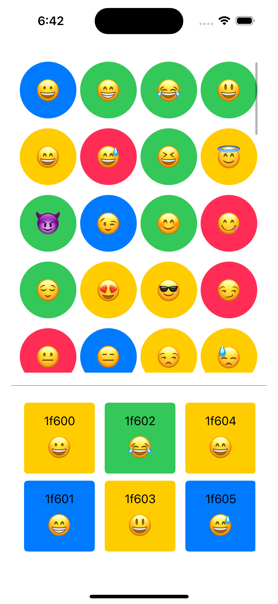
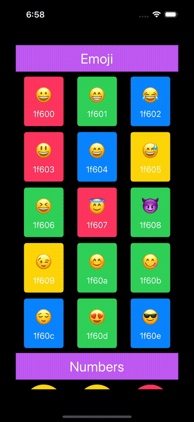

#  Demonstrate how to Lazy grid views

- Shown example of using `LazyVGrid` & `LazyHGrid`
- Also shown example of pinned views with these grids.

## UI screenshot & Videos:
| Normal | With Pinned headers|
|--------|--------------------|
| |  |

## Reference blog:

- https://developer.apple.com/documentation/swiftui/lazyvgrid
- https://rohit-13.medium.com/exploring-the-swiftuis-grid-view-lazyvgrid-griditem-and-grid-gridrow-888fca958b0f
- https://www.hackingwithswift.com/quick-start/swiftui/how-to-position-views-in-a-grid-using-lazyvgrid-and-lazyhgrid

