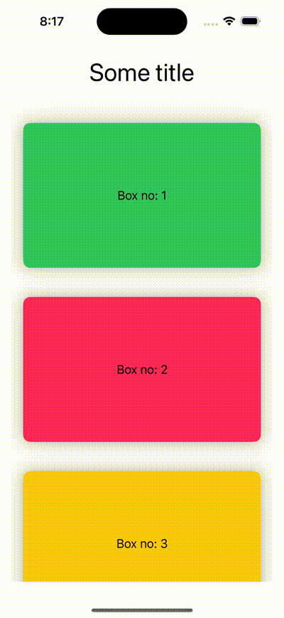
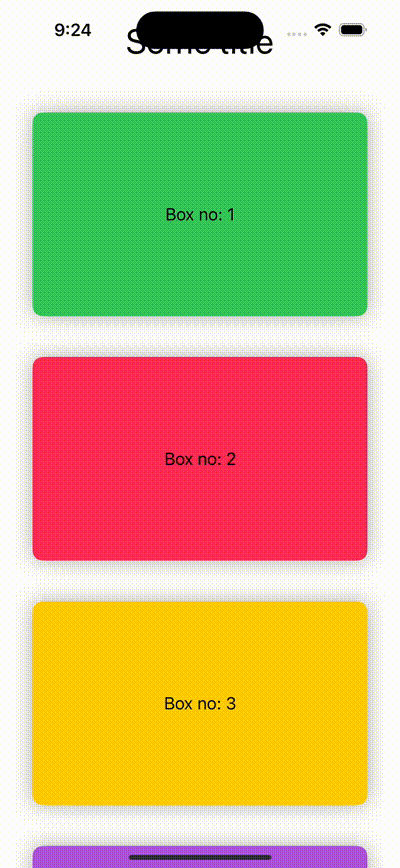

#  Demonstrate - ignoreSafeArea modifier

## UI screenshot:
| With default safe area | ignore safe are |
| -----------------------| ----------------|
|  |  |

## Reference blog:
- https://developer.apple.com/documentation/swiftui/adding-a-background-to-your-view#Extend-the-background-into-the-safe-areas
- https://fatbobman.com/en/posts/safearea/
