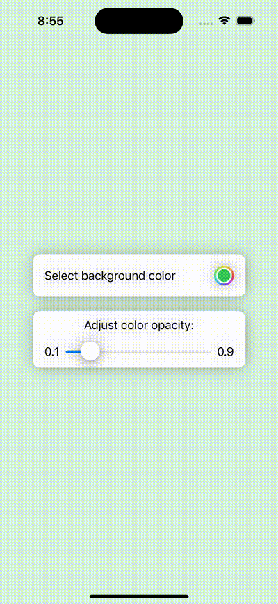

#  Demonstrate using `@Binding` property wrapper

- Added code snippet example showing how to use biding property wrapper to share common data state
  bidding parent-child views.
  
## UI screenshot:

### Reference blog:
- https://www.elsner.com/swiftuis-state-management-an-in-depth-overview/

