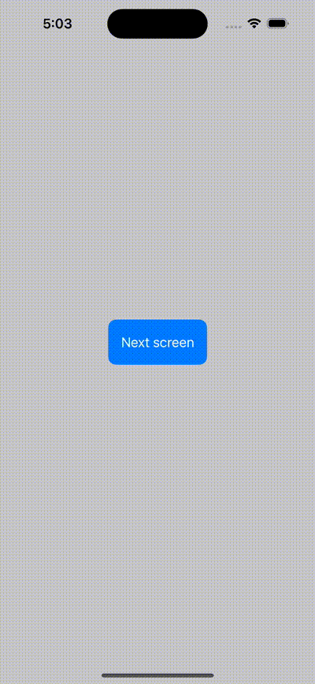

#  Presenting new Screens

- Shown two example of presenting screen with style:
    - Full screen cover
    - Sheet screen

## UI screenshots:
- 
- 

### Reference blogs:
- https://www.avanderlee.com/swiftui/presenting-sheets/
- 
