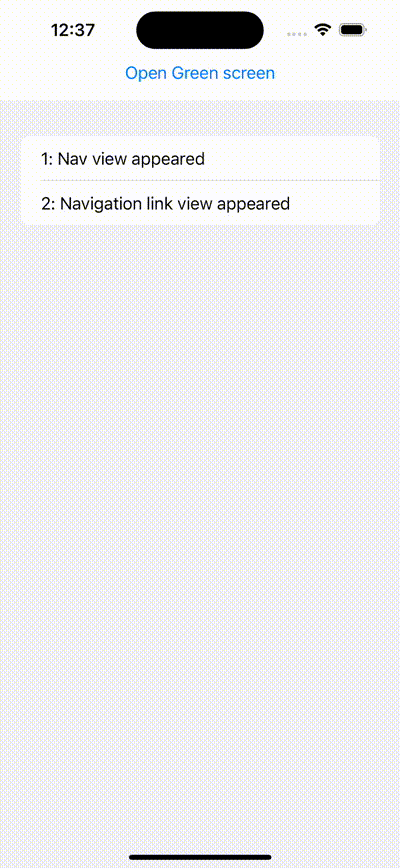

#  View life cycle methods

- Added example to use view life cycle methods:
  - onAppear(:)
  - onDisappear(:)

## UI screenshot
- 

### Reference blog
- 
- https://medium.com/@ramdhas/task-vs-onappear-78cda282342d
