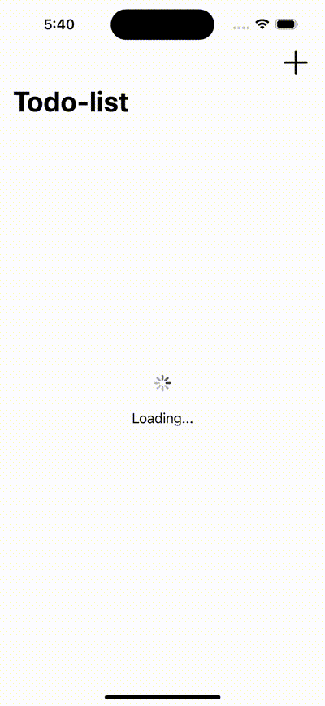

#  @ObservedObject / @StateObject wrapper

- Created a TODO-list app screen using the `@ObservedObject` & `@StateObject` property wrapper.
- Created two screen showing data between different screens.

## UI screenshot
- 

### Reference blog:
- https://pedroalvarez-29395.medium.com/swiftui-stateobject-x-observedobject-when-to-use-each-one-f738eb57ba6e
