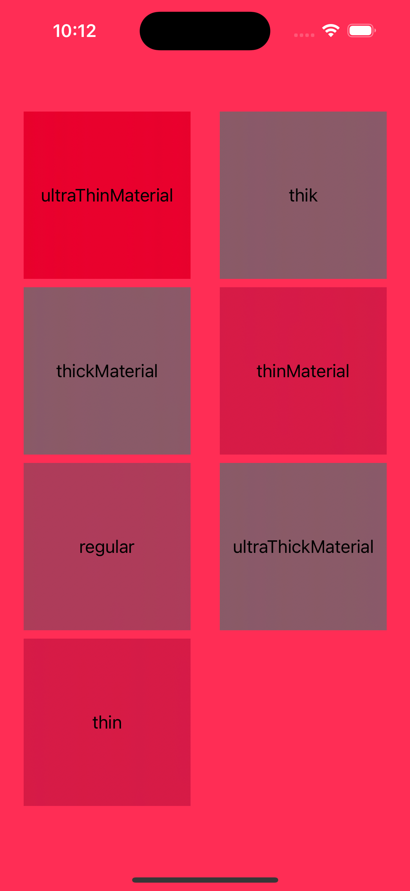

#  Background material

- Added example to show using background material to make view transparent.

## UI screenshot
- 

### Reference blog
- https://betterprogramming.pub/build-a-glassmorphism-login-screen-using-swiftui-materials-b909b1527414

