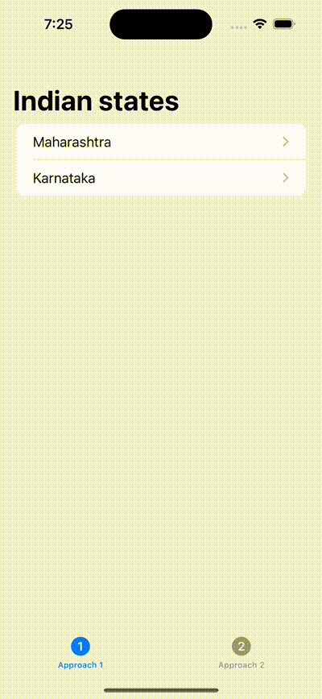

#  NavigationStack

- Added examples of showing how to use new `NavigationStack` view.
- Also shown how to use `NavigationPath` to navigation to any path/screen like `pop to root view`
  using navigation path.

## UI screenshot
- 

### Reference videos
- https://www.youtube.com/watch?v=pwP3_OX2G9A
- https://www.swiftanytime.com/blog/navigationstack-in-swiftui
