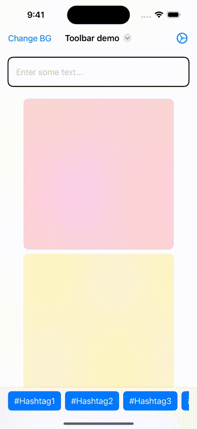

#  Toolbar

- Added example of using new `Toolbar` & `ToolBarItem` API to show custom view at different position
- Added custom buttons at following positions:
    - Nav bar leading/trailing button
    - Nav bar title action button
    - Bottom bar custom views
    - Custom button on keyboard bar button

## UI screenshot
- 
