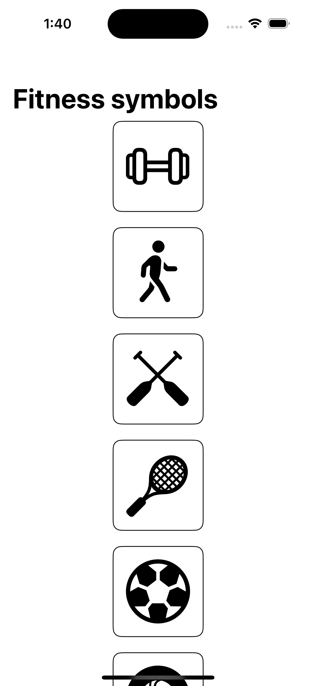

#  Group

- Added an example showing how `Group` component can be used to group different views and apply
  common property modifiers to each of its subviews.

## UI screenshot
- 

### Reference doc
- https://developer.apple.com/documentation/swiftui/group
