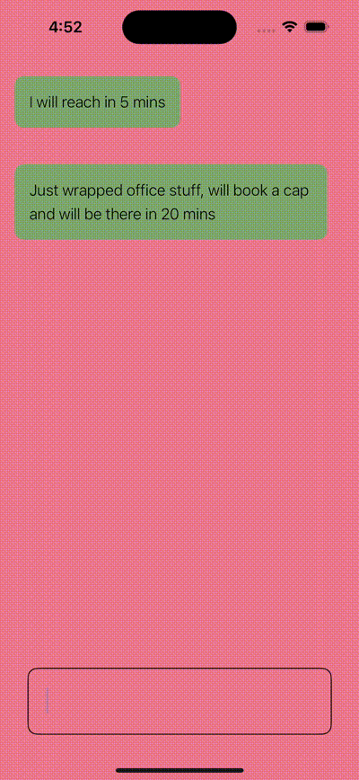

#  Popover

- Added example to present a popover options to add quick emoji reply to messages.

## UI screenshot
- 

### Reference doc
- https://developer.apple.com/documentation/swiftui/tabcontent/popover(ispresented:attachmentanchor:arrowedge:content:)
