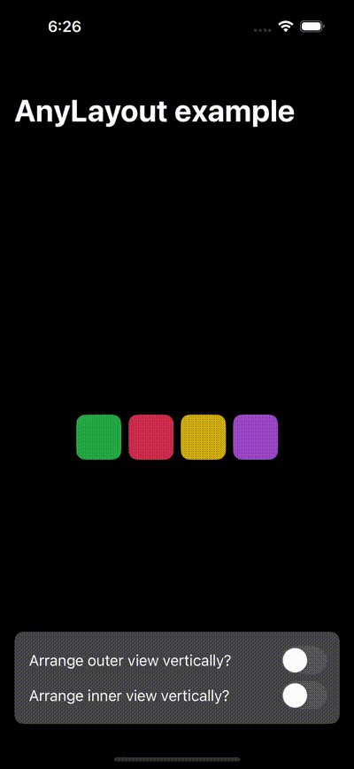

#  AnyLayout

- Added an example to use `AnyLayout` type-erased instance of layout protocol to transition between
  multiple layout while maintaining the identity of the views.

## UI screenshot
- 

### Reference link
- https://developer.apple.com/documentation/swiftui/anylayout
- https://sarunw.com/posts/swiftui-anylayout/
- https://designcode.io/swiftui-handbook-anylayout-transition
