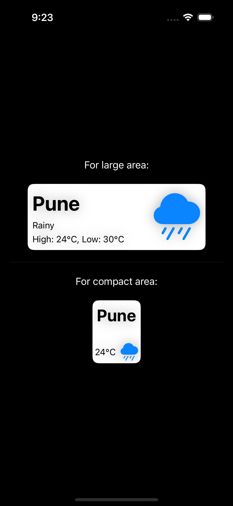

#  ViewThatFits

- Added an example show how the `ViewThatFits` can be used to evaluate and return the child view
  that best fits within the parent views available space.

## UI screenshot
- 

### Reference blogs
- https://developer.apple.com/documentation/swiftui/viewthatfits
