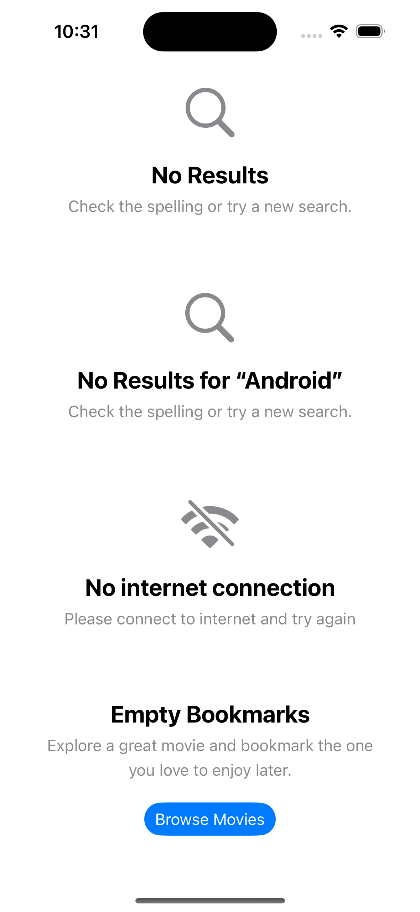

#  ContentUnavailableView

- Added a simple example showing how to use `ContentUnavailableView` view to show content unavailable or not found
  message using a consistent view that Apple has provided.

## UI screenshot
- 

### Reference doc
- https://developer.apple.com/documentation/swiftui/contentunavailableview
- https://sarunw.com/posts/content-unavailable-view-in-swiftui/
- https://www.createwithswift.com/display-empty-states-with-contentunavailableview-in-swiftui/
- https://www.avanderlee.com/swiftui/contentunavailableview-handling-empty-states/
