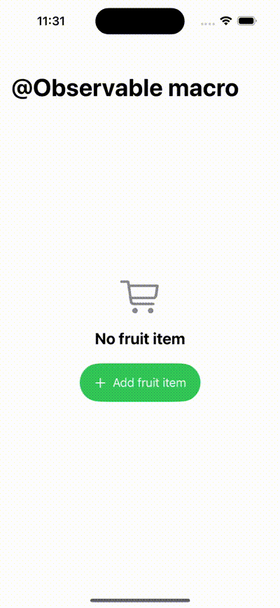

#  @observable macro

- Added example that make use of @obserable macro for model class and observing changes to its properties instead
  of using old @ObserableObject/@StateObject/@ObservedObject & @EnvironmentObject.

## UI screenshot
- 

### Reference blog
- https://developer.apple.com/documentation/Observation?language=objc
- https://developer.apple.com/documentation/swiftui/migrating-from-the-observable-object-protocol-to-the-observable-macro?language=objc
- https://www.youtube.com/watch?v=W6FF70H_GwI

